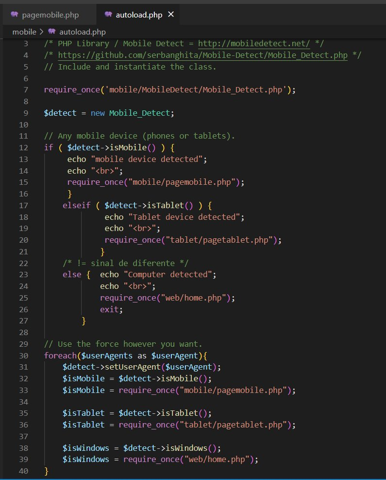

# Mobile - Tablet

## PHP Lib Mobile Detect

### PHP Library / Mobile Detect = http://mobiledetect.net/ 

### GitHub Mobile Detect = https://github.com/serbanghita/Mobile-Detect/

----------------------------------

### Eu fiquei semanas estudando e testando o código PHP da Lib Detect_Mobile.php e agora finalmente ficou do jeito que gostei.
### Quando o mobile detect detecta que a url é de um celular ele chama a pagina do celular.
### Quando o mobile detect detecta que a url é de um tablet ele chama a pagina do tablet.
### quando o mobile detect detecta que a url não é de celular e não é de tablet ele chama a pagina do computador.

---------------------------------------

### I spent weeks studying and testing the Lib Detect_Mobile.php code and now it's finally the way I like it.
### When the cell phone detects that the url is from a cell phone, it calls the cell page.
### When the cell phone detects that the url is from a tablet it calls the tablet page.
### when the cell phone detects that the url is not from a cell phone and is not from a tablet, it calls the computer page.

------------------------------------

